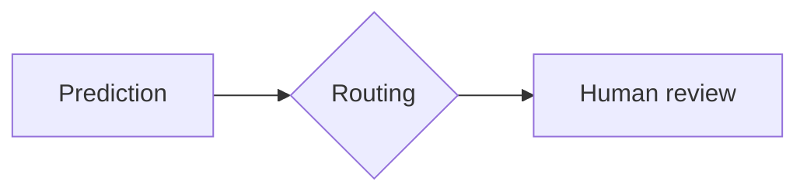

# EnerGuard — Human Oversight for Predictive Maintenance

[](https://github.com/GuidoMerliniEnel/ai-act-hackaton/actions/workflows/ci.yml)
[](https://github.com/GuidoMerliniEnel/ai-act-hackaton/actions/workflows/docs.yml)
[](LICENSE)

A predictive-maintenance model for grid assets wrapped in an **EU AI Act
Art. 14 human-oversight layer**: risk-based routing (HIC / HITL / HOTL),
an approval queue with mandatory justifications, emergency stop, bias and
drift monitoring, natural-language explanations, and a tamper-evident audit
trail.

Built during the _AI Human Oversight Hackathon_ (Deloitte × Enel FNC, 2026)
on top of the EnerGuard starter kit.

## Overview

| Component           | What it does                                                               | AI Act reference |
| ------------------- | -------------------------------------------------------------------------- | ---------------- |
| `train_baseline.py` | Random-forest failure predictor (30 days), thresholds per user criticality | Art. 10, 15      |
| `oversight_manager` | Routing matrix, review queue, SLA escalation, emergency stop, KPIs         | Art. 14          |
| `bias_detector`     | Disaggregated metrics, calibration gap, simulated drift, alerts            | Art. 10, 14(4)   |
| `explainer`         | SHAP factors translated into operator language (template or LLM)           | Art. 13, 14(4)   |
| `audit_logger`      | Append-only JSONL log with hash chaining                                   | Art. 12          |
| `app.py`            | Streamlit supervision dashboard                                            | Art. 14          |

Full documentation, including the **model card**, **impact assessment** and
**oversight declaration**, is in [`docs/`](docs/index.md) and is published as
a static site.

> Source code, code comments and the decision log
> ([TRACCIAMENTO_MODIFICHE.md](TRACCIAMENTO_MODIFICHE.md)) are in Italian,
> as required by the hackathon. Documentation is in English, following the
> Enel OSPO guidelines.

## Prerequisites

- Python 3.10+
- Git

## Installation

```bash
git clone https://github.com/GuidoMerliniEnel/ai-act-hackaton.git
cd ai-act-hackaton

python3 -m venv .venv
source .venv/bin/activate
pip install -r requirements.txt
```

## Configuration

All runtime parameters live in `.env` (never committed). Copy the template
and fill in the values:

```bash
cp .env.example .env
```

| Variable          | Description                                            | Default              |
| ----------------- | ------------------------------------------------------ | -------------------- |
| `LLM_PROVIDER`    | `openai`, `anthropic`, `azure`, `compatible` or `none` | `none`               |
| `LLM_API_KEY`     | Provider API key                                       | empty                |
| `LLM_MODEL`       | Model or Azure deployment name                         | empty                |
| `LLM_BASE_URL`    | Endpoint (required for `azure` and `compatible`)       | empty                |
| `LLM_TIMEOUT`     | Request timeout in seconds                             | `20`                 |
| `LLM_API_VERSION` | Azure OpenAI API version                               | `2024-12-01-preview` |

With `LLM_PROVIDER=none` the dashboard uses deterministic template
explanations. See [LLM configuration](docs/getting-started/llm-configuration.md).

## Usage

```bash
python train_baseline.py   # trains the model, writes modello.joblib and predizioni.csv
streamlit run app.py       # opens the dashboard at http://localhost:8501
python test_llm.py         # checks the explanation engine (template and LLM)
```

Stop the dashboard with <kbd>Ctrl</kbd>+<kbd>C</kbd>. The review queue is
held in memory and resets on restart; only `audit_trail.jsonl` persists.

## Documentation Site (Zensical)

The documentation in `docs/` is built with [Zensical](https://zensical.org/),
a static site generator from the creators of Material for MkDocs. The
configuration and theme follow the
[Enel OSPO](https://github.com/ENEL-GICT-PTG/OSPO) site (Enel Design System:
magenta primary, ocean blue accent, Inter font, light and dark mode).

### Install

```bash
source .venv/bin/activate
pip install -r requirements-docs.txt     # pinned zensical version
zensical --version
```

### Preview locally

```bash
zensical serve                  # http://localhost:8000, reloads on save
zensical serve -o               # also opens the browser
zensical serve -a localhost:8080  # different address or port
```

### Build the static HTML

```bash
zensical build --clean          # --clean drops the build cache first
```

The output goes to `site/` (git-ignored). Open `site/index.html` or serve
the folder with any static web server.

### Add or edit a page

1. Create or edit a Markdown file under `docs/`, e.g.
   `docs/compliance/new-page.md`.
2. Register it in the `nav` list at the top of `zensical.toml`:

   ```toml
   { Compliance = [
     "compliance/index.md",
     { "New Page" = "compliance/new-page.md" },
   ] },
   ```

   Pages missing from `nav` are **silently dropped** from the build.

3. Run `zensical serve` and check the page, then `zensical build --clean`
   before opening a pull request.

### Writing features

Enabled extensions: admonitions, tabs, task lists, footnotes, tables,
emoji, code highlighting with copy button, and Mermaid diagrams.

````markdown
!!! warning "Declared limit"
Text of the note.


````

Custom admonitions `!!! do` and `!!! dont`, and the oversight-level badges
`<span class="level hic">HIC</span>`, `hitl`, `hotl`, are defined in
`docs/stylesheets/extra.css`.

### Site layout

```text
zensical.toml                 # site config: name, URL, nav, theme, extensions
overrides/main.html           # template overrides (extends base.html)
docs/
├── index.md                  # home page with cards
├── about/                    # scenario, hackathon, OP36 mapping
├── getting-started/          # installation, dashboard usage, LLM setup
├── architecture/             # overview, modules, dataset
├── compliance/               # AI Act, model card, impact assessment, oversight declaration
├── quality/                  # KPIs A1–A6, verification tests T1–T6
├── decisions/                # decision log D-01..D-40 (English)
├── project/                  # contributing, security, license
├── stylesheets/extra.css     # Enel Design System tokens (--enel-*)
└── assets/images/            # logo.svg, favicon.svg
```

### Theme

Change colors only through the `--enel-*` tokens in
`docs/stylesheets/extra.css`. Light scheme is `enel`, dark scheme is
`slate`, and `primary`/`accent` are `custom` in `zensical.toml`. See
`.github/skills/enel-design-system/SKILL.md`.

### Publish to GitHub Pages

`.github/workflows/docs.yml` builds and deploys the site on every push to
`main` (or manually from **Actions → Documentation → Run workflow**).
One-time setup: **Settings → Pages → Source: GitHub Actions**. The site is
served at the `site_url` set in `zensical.toml`.

## Project Structure

```text
ai-act-hackaton/
├── .github/                    # CI/CD, templates, Copilot customizations
├── docs/                       # Documentation site source (Markdown)
├── overrides/                  # Zensical template overrides
├── app.py                      # Streamlit supervision dashboard
├── audit_logger.py             # Hash-chained audit trail
├── bias_detector.py            # Fairness, calibration and drift monitoring
├── explainer.py                # SHAP + template/LLM explanations
├── oversight_manager.py        # Routing, queue, emergency stop, KPIs
├── train_baseline.py           # Model training and disaggregated metrics
├── utils_io.py                 # CSV loading and feature preparation
├── test_llm.py                 # Explanation engine smoke test
├── energuard_dataset*.csv      # Synthetic dataset (2,400 assets)
├── TRACCIAMENTO_MODIFICHE.md   # Decision log D-01..D-40 (Italian)
├── zensical.toml               # Documentation site configuration
├── requirements.txt            # Application dependencies
└── requirements-docs.txt       # Documentation dependencies
```

## Contributing

See [CONTRIBUTING.md](CONTRIBUTING.md). All participants are expected to
follow the [Code of Conduct](CODE_OF_CONDUCT.md). Report vulnerabilities as
described in [SECURITY.md](SECURITY.md).

## License

Licensed under the [Apache License 2.0](LICENSE). See [NOTICE](NOTICE) for
attributions.

## Acknowledgements

- Deloitte × Enel FNC — EnerGuard starter kit and hackathon materials
- [Enel OSPO](https://github.com/ENEL-GICT-PTG/OSPO) — repository and
  documentation guidelines
- [Enel GICT Reference Architectures](https://github.com/ENEL-GICT-PTG/reference_architectures)
  — OP35/OP36 governance and Copilot customizations
- [scikit-learn](https://scikit-learn.org/), [SHAP](https://shap.readthedocs.io/),
  [Streamlit](https://streamlit.io/), [Zensical](https://zensical.org/)
