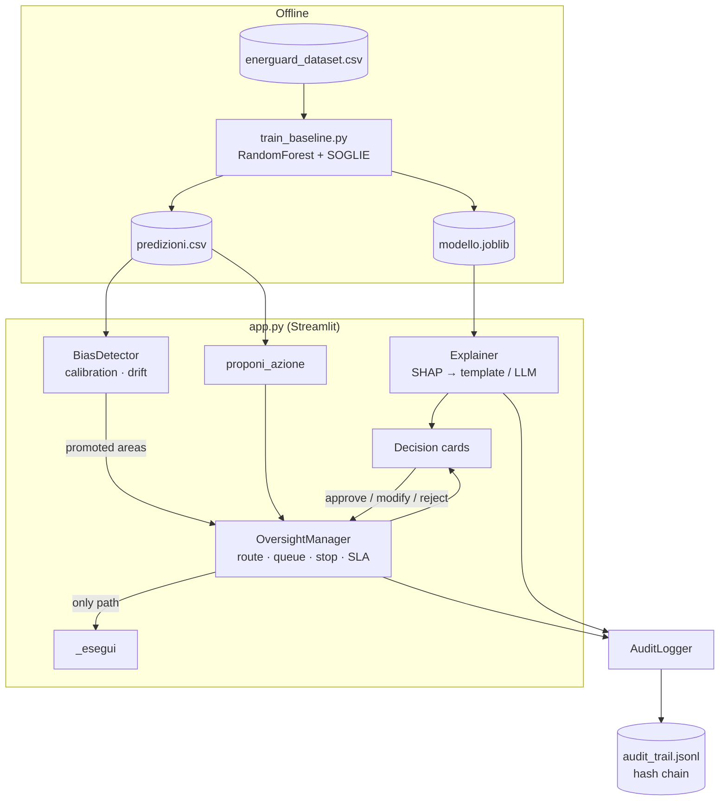
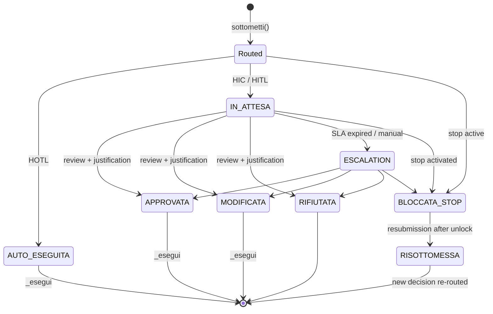

# Architecture

EnerGuard is a single-process Python application. The model produces
predictions offline. The dashboard loads them, routes each recommendation
through the oversight manager, and records every transition in an
append-only, hash-chained log.

## Decision lifecycle

Only `APPROVATA`, `MODIFICATA` and `AUTO_ESEGUITA` (HOTL only) reach
`_esegui`. The method also asserts that the decision is not HIC
auto-executed and is not under an active stop
([D-10](../decisions/index.md#d-10)).

## Design principles

| Principle                  | Implementation                                                         |
| -------------------------- | ---------------------------------------------------------------------- |
| Single execution point     | `OversightManager._esegui` with state, level and stop assertions       |
| Declared = implemented     | `route()` and an independent `livello_dichiarato()`; KPI A6 compares them |
| Everything is logged       | `AuditLogger.log` on every transition, thread-safe                     |
| Tamper evidence            | SHA-256 hash chain verified on every page load                         |
| The LLM does not decide    | Numbers come from the model; the LLM only rephrases, with guardrails   |
| Bias handled by oversight  | Calibration alert promotes an area to HITL rather than retuning labels |

See [Modules](modules.md) and [Dataset](dataset.md) for details.
