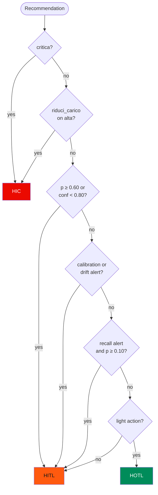

# Oversight Declaration

This page is the routing matrix that EnerGuard **declares** and
**implements**. The code holds it twice: in `OversightManager.route()`
and, independently, in `OversightManager.livello_dichiarato()`. KPI A6
compares the two on every decision. The target is 100%.

## Oversight levels

| Level | Name               | Meaning                                                                  |
| ----- | ------------------ | ------------------------------------------------------------------------ |
| HIC   | Human-in-command   | Absolute human veto: only a human decides. Never auto-executed       |
| HITL | Human-in-the-loop  | Human approval required before execution                              |
| HOTL | Human-on-the-loop  | The system acts; humans monitor afterwards and can stop it            |

## Routing matrix

Rules are evaluated **in order**; the first match wins.

| # | Condition                                                                   | Level | Justification |
| - | --------------------------------------------------------------------------- | ----- | ------------- |
| 1 | User criticality = `critica`                                                | HIC | An error on hospitals or critical infrastructure is irreversible |
| 2 | Action = `riduci_carico` **and** criticality = `alta`                       | HIC | Load reduction on a high-criticality user interrupts service |
| 3 | Probability ≥ 0.60 **or** confidence < 0.80                                 | HITL | High risk or an uncertain model: a human must judge |
| 4 | Area under an active calibration or drift alert                             | HITL | Possible label bias or degraded performance: no auto-execution ([D-19](../decisions/index.md#d-19), [D-27](../decisions/index.md#d-27)) |
| 5 | Area under a recall-gap alert **and** probability ≥ 0.10                  | HITL | Where the model misses more failures (today North and Centre), routine inspections are reviewed by a human ([D-43](../decisions/index.md#d-43)) |
| 6 | Action is light (`nessuna_azione`, `ispezione_routine`)                     | HOTL | Low cost, reversible: the AI acts alone |
| 7 | Anything else                                                               | HITL | Prudent default |

## Thresholds

| Parameter                    | Value  | Source                                  |
| ---------------------------- | ------ | --------------------------------------- |
| High-risk probability        | 0.60   | `OversightManager(soglia_rischio_alto)` |
| High confidence              | 0.80   | `OversightManager(soglia_confidenza_alta)` |
| Calibration alert            | 0.10   | `BiasDetector(soglia_gap_calibrazione)` |
| Recall-gap alert / watch threshold | 0.15 gap / p ≥ 0.10 | `BiasDetector(soglia_gap_recall)`, `OversightManager.soglia_vigilanza` |
| Drift alert                  | reference accuracy − 0.10 for 2 consecutive weeks | `BiasDetector.allerta_drift` |
| SLA before escalation        | 30 min | `OversightManager(sla_minuti)`          |
| Minimum justification length | 15 characters | `revisiona`, `attiva_stop`, `disattiva_stop`, `risottometti` |

!!! note "What HOTL means in practice"
    With confidence = `max(p, 1-p)`, confidence ≥ 0.80 and p < 0.60 together
    mean p ≤ 0.20. HOTL therefore applies only to standard or high
    users with failure probability ≤ 0.20, outside alerted areas, and in
    North and Centre only below 0.10. On the test set the split is 60 HIC,
    423 HITL and 237 HOTL. Rule 5 moves 84 decisions from HOTL to HITL and
    cuts real failures auto-executed without review from 6 to 2 (both in
    the Islands).

## Proposed action

The action is derived from risk by rules (`proponi_azione`,
[D-09](../decisions/index.md#d-09)):

| Probability   | Action                                                                     |
| ------------- | -------------------------------------------------------------------------- |
| ≥ 0.85        | `riduci_carico` (high/critical users) or `ispezione_urgente` (standard)    |
| 0.60 – 0.85   | `programma_manutenzione`                                                   |
| 0.10 – 0.60   | `ispezione_routine`                                                        |
| < 0.10        | `nessuna_azione`                                                           |

## Human controls

| Control                 | Rule                                                                                       |
| ----------------------- | ------------------------------------------------------------------------------------------ |
| Review                  | Approve / Modify / Reject / Escalate, justification ≥ 15 chars, no duplicates ([D-11](../decisions/index.md#d-11)) |
| SLA                     | Pending > 30 min → `ESCALATION`, never executed silently ([D-12](../decisions/index.md#d-12)) |
| Emergency stop          | Global, by area, by asset type or combined; also freezes the existing queue; one click plus confirmation ([D-13](../decisions/index.md#d-13), [D-14](../decisions/index.md#d-14)) |
| Stop deactivation       | Justification, acknowledgement and a **different** second operator ([D-15](../decisions/index.md#d-15)) |
| Resubmission            | Blocked decisions stay blocked; resubmitted once, re-routed from scratch ([D-16](../decisions/index.md#d-16)) |
| Execution               | Only through `_esegui`, which rejects pending, rejected, stopped and HIC auto-executed decisions ([D-10](../decisions/index.md#d-10)) |
