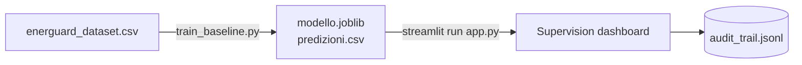

# Getting Started

Three steps take you from a fresh clone to a running supervision dashboard:

1. [Install](installation.md) the dependencies and train the model.
2. [Use the dashboard](usage.md): review the queue, try the emergency stop,
   inspect the audit trail.
3. Optionally, [configure an LLM](llm-configuration.md) for more natural
   explanations. Without it, deterministic templates are used.

