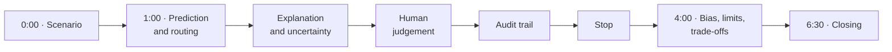
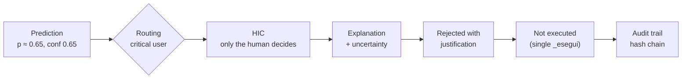

# Presentation

The 6–7 minute pitch for the jury, following the structure the hackathon
asks for: **1' scenario, 3' the path of ONE decision, 2' bias, limits and
trade-offs**. It is the English version of the
[Italian speech](https://github.com/GuidoMerliniEnel/ai-act-hackaton/blob/main/consegna/5_Discorso_Presentazione.md)
used in the live demo.

!!! tip "Before starting"
Run `python prova_test_giuria.py` (expect 10/10) and open the dashboard
with `./run_dashboard.sh` at least 30 seconds before speaking. For a
narrated rehearsal: `python demo_automatica.py`.

---

## 1. The scenario · 0:00–1:00

- :material-transmission-tower:{ .lg .middle } **The system**

  ***

  A model predicts which grid assets fail within 30 days: HV lines,
  transformers, primary substations, wind turbines. **High risk** under
  the AI Act, Annex III: critical infrastructure.

- :material-scale-unbalanced:{ .lg .middle } **The asymmetry**

  ***

  A missed failure on a hospital feeder cannot be undone; an
  unnecessary inspection costs a few hours. Thresholds **0.30** for
  standard users and **0.20** for high and critical users, assuming a
  10:1 cost ratio.

- :material-target:{ .lg .middle } **The goal**

  ***

  The kit model (AUC 0.868) is unchanged. We built a system an operator
  can **understand, monitor, correct and stop**.

> _"At the top the operator always sees the state: pending decisions,
> overrides, explanation coverage, fairness alerts and log integrity."_

**Show:** the KPI bar and the sidebar.
_Tier 1 (justified threshold) · Art. 14: understand and monitor_

---

## 2. The path of ONE decision · 1:00–4:00

We follow a single decision end to end: **AST-01148**, a primary
substation in the South serving a critical user.

### Prediction and routing

| Level                                | When                                            | Meaning                         |
| ------------------------------------ | ----------------------------------------------- | ------------------------------- |
| HIC   | Critical user, or load reduction on a high user | Only the human decides, always  |
| HITL | Risk ≥ 0.60 or confidence < 0.80                | Human approval before execution |
| HOTL | Routine action, risk ≤ 0.20                     | The AI acts, the human monitors |

**Show:** open the AST-01148 card. _Tier 2A_

### Explanation and uncertainty

- **"In parole semplici"** box: traffic light, "about 6 in 10", what to do.
- Main reasons: vibration **8.7**, well above normal, and **451 days**
  without maintenance.
- **Uncertainty is declared**: with confidence 0.65 the system says it is
  not sure.
- **"What if"**: with average vibration the risk would drop to about 3 in
  10, but a check would still be needed.
- **Three most similar assets** of the same type: all three failed.
- Expert details: three factors with direction and the declared **source**
  (template today; LLM with guardrails and automatic fallback when
  configured).

_Tier 3A · test T4_

### Human judgement

!!! dont "Reject with “ok”"
Refused: the justification needs at least 15 characters and cannot
copy one already used.

!!! do "Reject with a real justification"
_"Sopralluogo di ieri: vibrazione nella norma, sensore da ricalibrare"_.
The decision leaves the queue and is **not executed**: the only
execution point, `_esegui`, rejects pending, rejected, stopped or HIC
decisions. After 30 minutes without a decision: escalation, never
silent execution.

Four reviewer actions: **approve, modify, reject, escalate**.
_Tier 2B · tests T1, T2_

### Audit trail

Who decided, what, when and why, rebuilt in seconds without opening the
file. Each record holds the hash of the previous one: editing a
justification breaks the chain, and every screen shows it.

**Show:** Audit trail tab, search AST-01148. _Tier 3C · test T6_

### Stopping the system

An incident on the South HV lines. The stop works **globally, by area, by
asset type or combined**. One click plus confirmation on
`area:Sud+tipo:linea_AT`: the **7 queued decisions** are blocked, everything
else continues, a red banner shows it. Lifting the stop needs a **second
operator**, and blocked decisions never restart on their own.

_Tier 2C · test T3_

---

## 3. Bias, limits, trade-offs · 4:00–6:30

### What we found

|                           | South              | Islands          |
| ------------------------- | ------------------ | ---------------- |
| Age, maintenance, sensors | almost identical   | almost identical |
| Recorded failure rate     | **0.24**           | **0.45**         |
| Calibration gap           | **+0.177** (alert) | −0.033           |

Two hypotheses: failures in the South are **under-reported**, or
**recording processes** differ between territories. Calibration points to
the first: the South has by far the largest gap between predicted and
recorded failures (in proportion the North is close, a declared limit).

### What we did

1. Removed `area_geografica` from the model: it acted as a proxy.
2. Did **not** raise the South threshold: those "false alarms" may be real
   failures.
3. An **alert that acts**: above a 0.10 calibration gap the area goes to
   human supervision. In the South the AI never acts alone.
4. Intersectional check: **standard users in North and Centre** are served
   worst (recall 0.65–0.68). There, even routine inspections now go to a
   human: real failures auto-executed drop from **6 to 2**, for **83** more
   reviews out of 720.
5. Continuous monitoring: accuracy and confidence over 12 simulated weeks,
   with an alert that disables automation after two bad weeks in a row;
   override rate per area and per reviewer.

The confidence × risk matrix uses the same rule as the declaration:
**KPI A6 = 100%**.

_Tier 1 · Tier 3B · test T5_

### What we have not solved

!!! warning "Declared limits" - Under-reporting in the South is a **hypothesis** to verify in the field. - In North and Centre about one failure in four comes **without sensor
signals**. - **183 unnecessary inspections** out of 720: the price of higher recall. - With 24–43 failures per area, differences are **signals, not proof**. - Drift is **simulated**, and two failures in the Islands remain automatic.

### Roles under the AI Act

| Role         | Who                                   | Main duties                                                        |
| ------------ | ------------------------------------- | ------------------------------------------------------------------ |
| **Provider** | Whoever develops the system           | Data governance, documentation, logging, design for oversight      |
| **Deployer** | The grid operator in the control room | Trained overseers, use per instructions, monitoring, log retention |

Everything is in the [model card](../compliance/model-card.md), the
[impact assessment](../compliance/impact-assessment.md) and the
[oversight declaration](../compliance/oversight-declaration.md).
_Tier 4_

---

## 4. Closing · 6:30–7:00

> _"In critical infrastructure, an accurate system that cannot be
> supervised is dangerous. EnerGuard leaves the decisions that matter to
> humans, and makes that measurable: we have already rehearsed the jury's
> six tests, ten checks out of ten. We are ready for your questions."_

---

## Likely questions

| Question                             | Short answer                                                                                                    |
| ------------------------------------ | --------------------------------------------------------------------------------------------------------------- |
| Why didn't you improve the model?    | The guide advises against it, and the main problem is in the labels, not the algorithm                          |
| Why an LLM?                          | Only for technical details, with guardrails and fallback; the part for everyone uses fixed rules                |
| What if I unplug the network?        | The card stays explained; the source says `template(fallback:...)`                                              |
| Where is the single execution point? | `OversightManager._esegui`: called only for HOTL auto-execution and approved or modified reviews                |
| Can the log be tampered with?        | It can be edited, but not silently: the hash chain breaks and the top bar shows it                              |
| Why not raise the South threshold?   | South "false positives" may be real unrecorded failures; raising it would amplify the bias (recall 0.88 → 0.65) |
| Why 0.30 and 0.20?                   | 10:1 cost ratio; 0.20 everywhere would flood the human queue (230 unnecessary inspections)                      |
